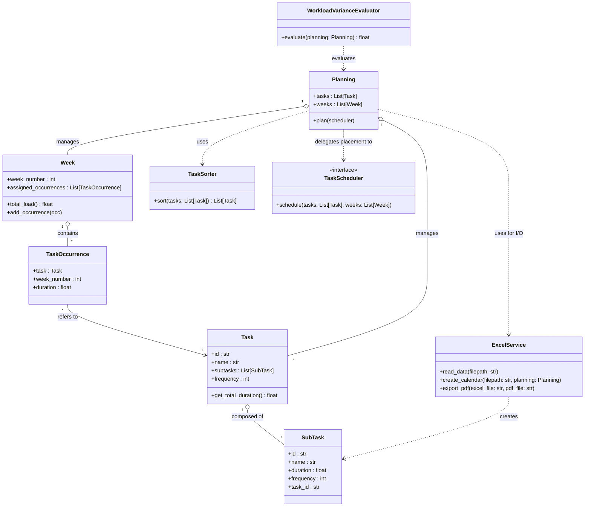

# Preventive Maintenance Scheduler

A Python-based scheduling engine designed to optimally distribute annual preventive maintenance tasks. Built with a strong emphasis on Object-Oriented Programming (OOP), SOLID principles, and algorithmic heuristics.

## 🧠 Algorithmic Approach

Scheduling maintenance tasks is a combinatorial optimization problem. In this specific industrial context, tasks possess **sequence-dependent constraints** (the placement of one task heavily influences the feasibility of others). 
Because formulating this exactly (e.g., via MILP) leads to state-space explosion, this engine implements a **Greedy Heuristic**.

The scheduling pipeline is divided into two steps:
1. **Sorting (`TaskSorter`):** Determines the priority of tasks before placement (e.g., by Largest Processing Time or Highest Frequency).
2. **Scheduling (`TaskScheduler`):** Iteratively places `TaskOccurrence`s into `Week` buckets, aiming to minimize the variance of `total_load()` across the 52 weeks while strictly respecting frequency intervals.

## 🏗️ System Architecture

The architecture strictly separates the **Data Model**, the **Business Logic**, and the **I/O Operations**. 



## ⚙️ Design Patterns & Extensibility

- **Strategy Pattern:** The `Planning.plan(scheduler)` method accepts any object implementing the `TaskScheduler` interface. This allows seamless swapping between the current `GreedyScheduler` and future implementations (like a `LocalSearchScheduler`).
- **Single Responsibility Principle (SRP):** 
  - `ExcelService` is solely responsible for I/O interactions.
  - `WorkloadVarianceEvaluator` is solely responsible for calculating the fitness of a schedule, keeping the `Planning` domain entity pure and agnostic of business evaluation rules.

## 🚀 Getting Started

```bash
git clone https://github.com/Orpheus76/preventive-maintenance-scheduler
cd preventive-maintenance-scheduler
pip install -r requirements.txt
python main.py --input data/maintenance_data.xlsx
```

## 🗺️ Roadmap / Future Work

- [x] **Core Architecture:** Set up domain models and decouple evaluation logic.
- [x] **Baseline Implementation:** Finalize the `GreedyScheduler` and `TaskSorter` logic.
- [ ] **Meta-heuristics:** Add a Local Search phase post-greedy placement to escape local optima and further flatten the workload curve.
